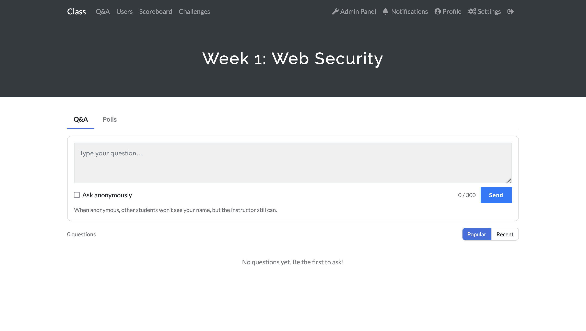
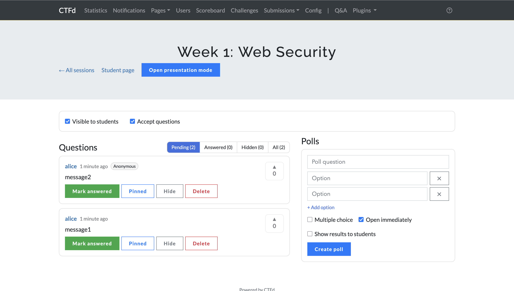
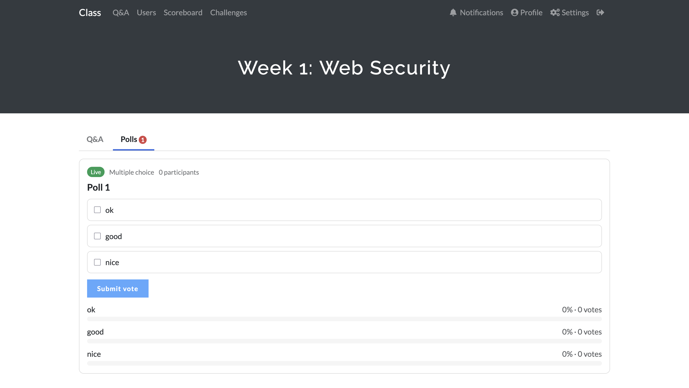
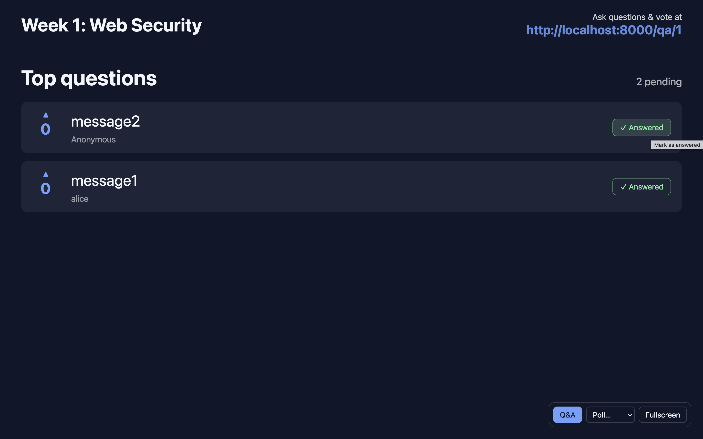
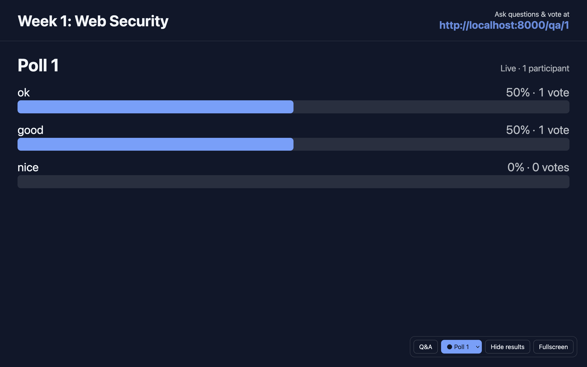

# CTFd-qa-plugin

## Features

<!-- Screenshots go in docs/images/. Desktop shots look best at ~1280px wide; side-by-side shots at ~800px. -->

### Q&A with upvotes

Students post questions and upvote the ones they want answered, so the most popular questions rise to the top.



- Questions up to 300 characters; students can delete their own
- Sort by **Popular** or **Recent**
- Pinned and answered questions are clearly marked
- Students can choose to ask anonymously.

### Moderation

Keep the discussion on track from the admin panel.



- Mark questions as answered, pin, hide, or delete them
- Filter by **Pending**, **Answered**, **Hidden**, or **All**
- Each question links to the author's CTFd account

### Live polls

Run quick single- or multiple-choice polls during class.



- Polls move from **Draft** → **Live** → **Closed**
- Choose whether students can see the results, and reset votes at any time
- Students can change their vote until the poll closes, and get a notification when a new poll starts

### Presentation mode

A dark, large-type full-screen view for the projector, with the URL students use to join shown at the top.

| Top questions | Poll results |
| :---: | :---: |
|  |  |

- Mark a question as answered right on the projected screen, with an 8-second **Undo**
- Keyboard shortcuts: `Q` questions, `P` poll, `H` hide results, `F` fullscreen
- The controls fade out when the mouse is idle, keeping the screen clean

### Live updates

Pages refresh automatically every few seconds (students 4 s, admin 3 s, presentation 2 s). No WebSocket required.


## Installation

Put this plugin folder under CTFd's `CTFd/plugins/` directory and restart CTFd. The `qa_*` tables are created automatically on startup. The folder can have any name; asset URLs follow it automatically.

```bash
cd CTFd/CTFd/plugins
git clone https://github.com/Charlie28661/CTFd-qa-plugin.git
```

With a Docker deployment, mount it as a volume:

```yaml
volumes:
  - ./CTFd-qa-plugin:/opt/CTFd/CTFd/plugins/CTFd-qa-plugin:ro
```

## Usage

1. Admin panel → Plugins → Q&A → Create a new session
2. Students log in to CTFd, click **Q&A** in the top navigation bar, and pick the session
3. On the session management page, the instructor clicks "Open presentation mode" and drags that window onto the projector
   - The control bar in the bottom-right corner switches between Q&A and polls, hides results, and toggles fullscreen (shortcuts `Q` `P` `H` `F`)
   - Each question has a "✓ Answered" button on its right. Clicking it removes the question from the projected screen, and an "Undo" button appears in the bottom-left corner for 8 seconds in case of a misclick
   - After the mouse stays still for 3 seconds, the control bar and the "✓ Answered" buttons fade out to keep the screen clean
   - Clicking "Present" on a poll in the admin panel switches the presentation window on the same computer to that poll
4. When creating a poll, check "Open immediately" to start it right away. After the poll ends, click "Show results to students" to let students see the results

## Permissions and security

- Student pages and APIs require login. The admin panel, admin APIs, and presentation mode are admin-only
- Every non-GET request goes through CTFd's built-in CSRF check
- User input is always rendered as plain text (`textContent`), never as HTML
- Asking and voting are rate limited **per account** (questions 10/min, upvotes 60/min, votes 30/min). CTFd's built-in rate limiter keys on IP address, and a classroom sharing one NAT IP would exhaust each other's quota, so this plugin keys on the account instead

## Notes

- Tables are created with `db.create_all()`. If you later change columns in `models.py`, existing databases are not updated automatically; you will need to add a migration yourself
- The refresh interval is set by the `S.poller(..., milliseconds)` call in `assets/qa_event.js`, `qa_admin.js`, and `qa_present.js`. Increase it for very large classes
- Deleting a session also deletes all of its questions and polls

## File structure

```
CTFd-qa-plugin/
├── __init__.py      # load(app): create tables, register routes and menu items
├── models.py        # Database tables
├── utils.py         # Serialization (anonymity handling), rate limiting
├── routes.py        # Student pages and API (/qa/...)
├── admin.py         # Admin pages, admin API, presentation mode (/admin/qa/...)
├── templates/
└── assets/          # CSS / JS (no build step)
```
